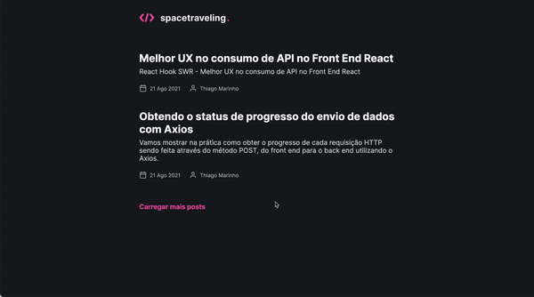

<h3 align="center">
  Desafio 03: Ignite Space Traveling Blog
</h3>

  

  

  

  

  <a href="#rocket-sobre-o-desafio">Sobre o desafio</a>&nbsp;&nbsp;&nbsp;|&nbsp;&nbsp;&nbsp;
  <a href="#memo-licença">Licença</a>

## :rocket: Sobre o desafio

### Template da aplicação

### Layot da aplicação

## :memo: Licença

Esse projeto está sob a licença MIT. Veja o arquivo [LICENSE](LICENSE) para mais detalhes.

---

Feito com 💜 by denismend
